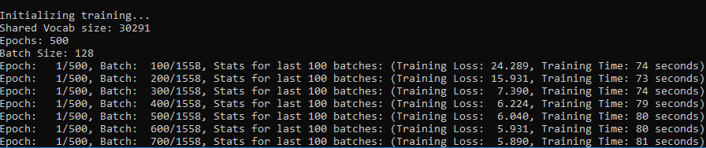

# seq2seq-chatbot
A sequence2sequence chatbot with TensorFlow.

## Chatting with a trained model
### To chat with a trained model from the model directory:

(Batch files are only available for windows as of now. For mac and linux users see instructions below for python console.)

For console chat: 
1. Run `chat_console_best_weights_training.bat` or `chat_console_best_weights_validation.bat`

For web chat:
1. Run `chat_web_best_weights_training.bat` or `chat_web_best_weights_validation.bat`

2. Open a browser to the URL indicated by the server console, followed by `/chat_ui.html`. This is typically: [http://localhost:8080/chat_ui.html](http://localhost:8080/chat_ui.html)

### To chat with a trained model from a python console:

1. Set console working directory to the **seq2seq-chatbot** directory. This directory should have the **models** and **datasets** directories directly within it.

2. Run chat.py with the model checkpoint path:
```shell
run chat.py models\dataset_name\model_name\checkpoint.ckpt
```

For example, to chat with the trained cornell movie dialog model **trained_model_v2**:

1. Download and unzip [trained_model_v2](seq2seq-chatbot/models/cornell_movie_dialog/README.md) into the [seq2seq-chatbot/models/cornell_movie_dialog](seq2seq-chatbot/models/cornell_movie_dialog) folder

2. Set console working directory to the **seq2seq-chatbot** directory

3. Run:
```shell
run chat.py models\cornell_movie_dialog\trained_model_v2\best_weights_training.ckpt
```

The result should look like this:


## Training a model
To train a model from a python console:

1. Configure the [hparams.json](seq2seq-chatbot/hparams.json) file to the desired training hyperparameters

2. Set console working directory to the **seq2seq-chatbot** directory. This directory should have the **models** and **datasets** directories directly within it.

3. To train a new model, run train.py with the dataset path:
```shell
run train.py --datasetdir=datasets\dataset_name
```

Or to resume training an existing model, run train.py with the model checkpoint path:
```shell
run train.py --checkpointfile=models\dataset_name\model_name\checkpoint.ckpt
```

For example, to train a new model on the cornell movie dialog dataset with default hyperparameters:

1. Set console working directory to the **seq2seq-chatbot** directory

2. Run:
```shell
run train.py --datasetdir=datasets\cornell_movie_dialog
```

The result should look like this:




## Visualizing a model in TensorBoard
[TensorBoard](https://www.tensorflow.org/programmers_guide/summaries_and_tensorboard) is a great tool for visualizing what is going on under the hood when a TensorFlow model is being trained.

To start TensorBoard from a terminal:
```shell
tensorboard --logdir=model_dir
```

Where model_dir is the path to the directory where the model checkpoint file is. For example, to view the trained cornell movie dialog model **trained_model_v2**:
```shell
tensorboard --logdir=models\cornell_movie_dialog\trained_model_v2
```


## Dependencies
The following python packages are used in seq2seq-chatbot:
(excluding packages that come with Anaconda)

- [TensorFlow](https://www.tensorflow.org/)
    ```shell
    pip install --upgrade tensorflow
    ```
    For GPU support: [(See here for full GPU install instructions including CUDA and cuDNN)](https://www.tensorflow.org/install/)
    ```shell
    pip install --upgrade tensorflow-gpu
    ```

- [jsonpickle](https://jsonpickle.github.io/)
    ```shell
    pip install --upgrade jsonpickle
    ```

- [flask 0.12.4](http://flask.pocoo.org/) and [flask-restful](https://flask-restful.readthedocs.io/en/latest/) (required to run the web interface)
    ```shell
    pip install flask==0.12.4
    pip install --upgrade flask-restful
    ```


## Relevant papers
1. [Sequence to Sequence Learning with Neural Networks](https://arxiv.org/abs/1409.3215)

